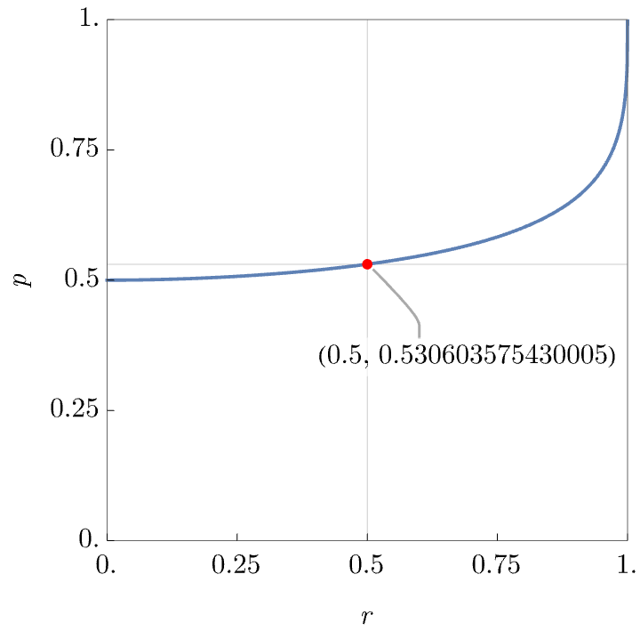

# Sum One, Somewhere

## Description

For a fixed p, independently label the nodes of an infinite complete binary tree 0 with probability p, and 1 otherwise. For what p is there exactly a 1/2 probability that there exists an infinite path down the tree that sums to at most 1 (that is, all nodes visited, with the possible exception of one, will be labeled 0). Find this value of p accurate to 10 decimal places.

## Solution

Let’s define the variable $r=\mathbb{P}[X]$, where $X$ is the event:

> “There exists an infinite path down the tree where the total sum is at most 1.”

Due to fact each node will independently follow a Bernoulli process of probability $p$ and the fact that the tree is complete and infinite, the tree will be _self-similar_. Selecting any node in the tree, it will be the root to a subtree whose probability of having an infinite path with total sum of at most 1 is also the same probability $r=\mathbb{P}[X]$.

Therefore we can split this in two cases based on the root node possibilities:

- **_Root is 0:_** If the root is labeled 0, we still need an infinite path starting from the root that contains _at most one 1 overall_. There are two subtrees (left and right), and we can proceed down _either one_ to build the path. So we’re interested in the probability that either left or right subtree contains such a path. This leads to:
    
    $$\mathbb{P}[\text{at least one child subtree has such a path}] = 2r - r^2$$ 
    
    (using the inclusion-exclusion principle: $\mathbb{P}[A \cup B] = \mathbb{P}[A] + \mathbb{P}[B] - \mathbb{P}[A \cap B]$).

- **_Root is 1:_** Since the root already contributes 1 to the path sum, the only way to keep the total sum less or equal than 1 for the rest of the path to contain _only 0s_. Let 
    
    $$q=\mathbb{P}[\text{subtree contains an infinite all-0 path}]$$
    
    Then, similar to before, the probability that **either** left or right subtree has an all-0 path is 
    
    $$2q - q^2$$
    
    Combining, the possibilities we have the equation:
    
    $$r=p(2r−r^2)+(1−p)(2q−q^2)$$
    
    Now, we have introduced probability of another event we need to solve for: the existence of a path with all 0s.
    This case is simpler as if the root node is not allowed to be $1$ and therefore that sub-case does not contribute (zero probability). 
    Meaning the probability of a tree having a path with all 0s is probability of root node being zero and either left/subtree having all-0 path: 
    
    $$q = p (2q - q^2)$$
    
    This equation allows for a trivial solution $q = 0 \implies p = 1/(2-r)$, which is not what we are looking for. We remove it by dividing by a $q$ factor, which reduces the problem to the system:
    
    $$r = p(2r−r^2)+(1−p)(2q−q^2) \tag{1}$$
    
    $$1 = p(2−q) \tag{2}$$

We can plug this into any computer algebra system to obtain the equation, but it would be more fun if we could do some elimination theory to obtain the polynomial in $p$ defining the algebraic solutions.
We start by rewriting eq. $(2)$ as 

$$p q = 2p-1$$

So we can multiply eq. $(1)$ by $p^2$, meaning $r p^2 = (2r−r^2) p^3 + (2q−q^2) p^2 - q p^2$, and a few substitutions simplifies to

$$ (2r−r^2) p^3 - (2+r) p^2 + 3p - 1 = 0$$

Similarly, by multiplying the previous equation by $(2-q)^3$, we obtain

$$q^3 - 3 q^2 + (2 + r) q -r^2 = 0$$

The problem requires that $r = \mathbb{P}[X] = 1/2$, which implies that the solutions is given by the real roots of

$$3 p^3 - 10 p^2 + 12 p - 4 = 0$$

$$4 q^3 - 12 q^2 + 10 q -1 = 0$$

These equations have a unique real solutions

$$p = 0.530603575430005\ldots$$

$$q = 0.115353822880684\ldots$$

**The solution is the the first 10 decimal places of p: 0.5306035754**.

