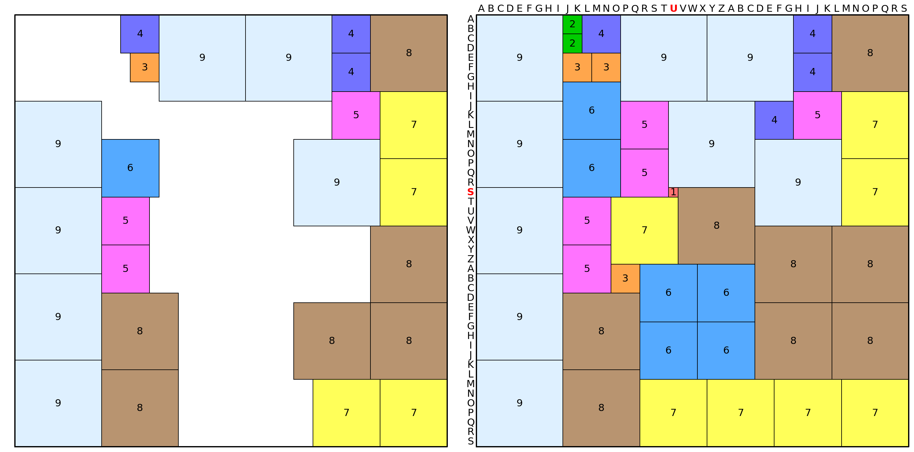
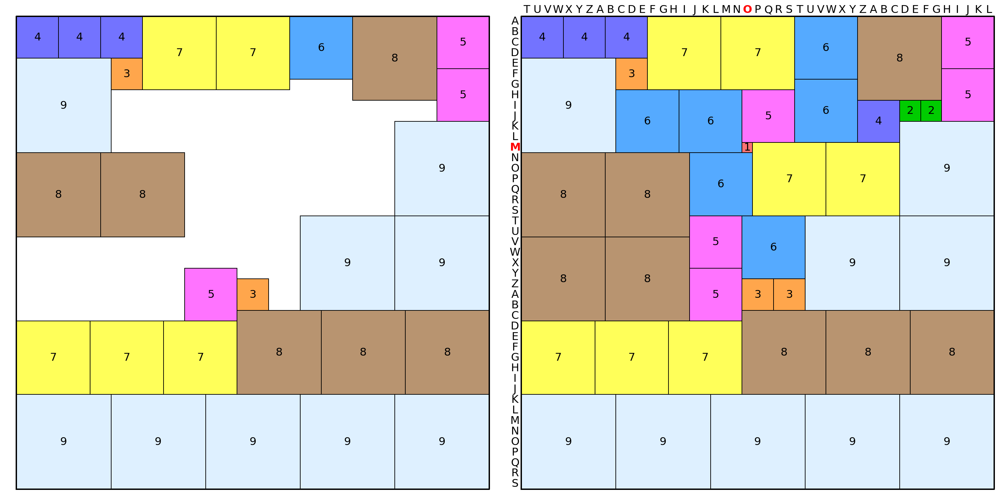
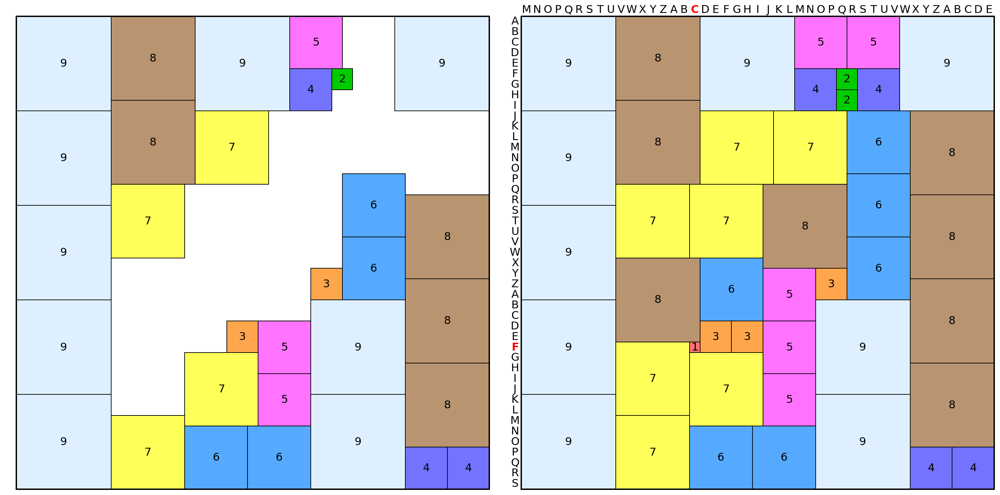
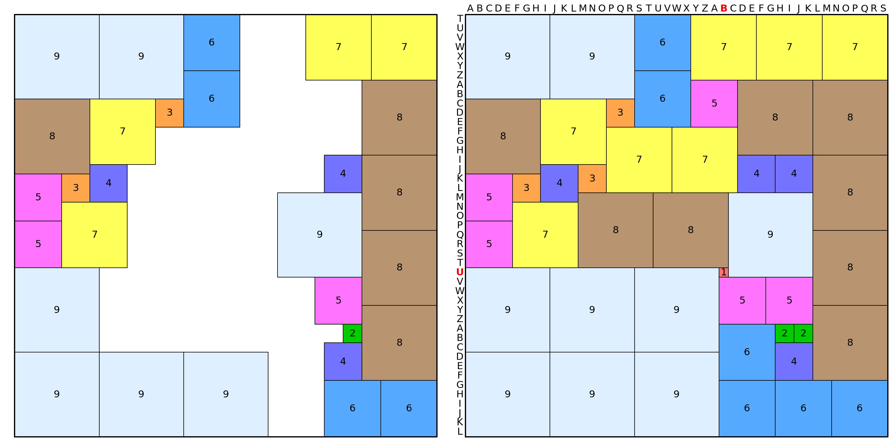
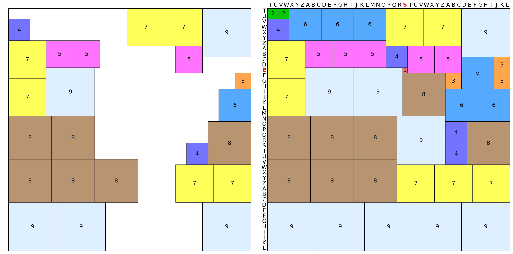
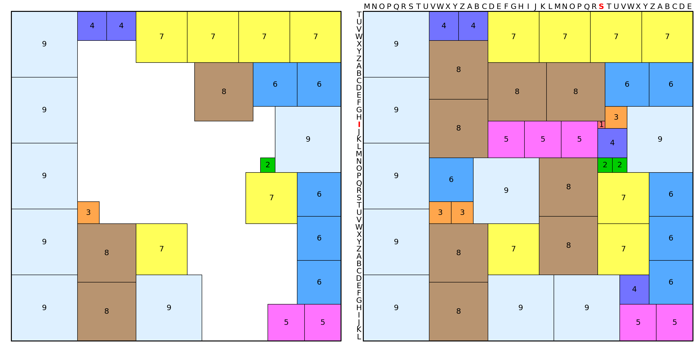
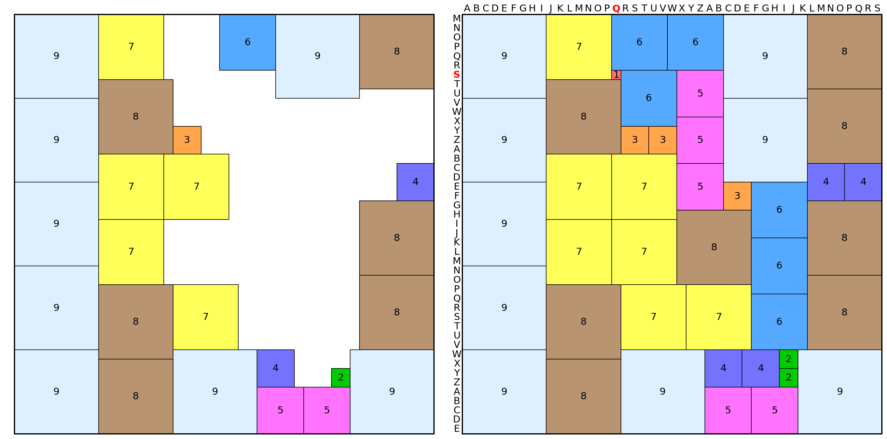
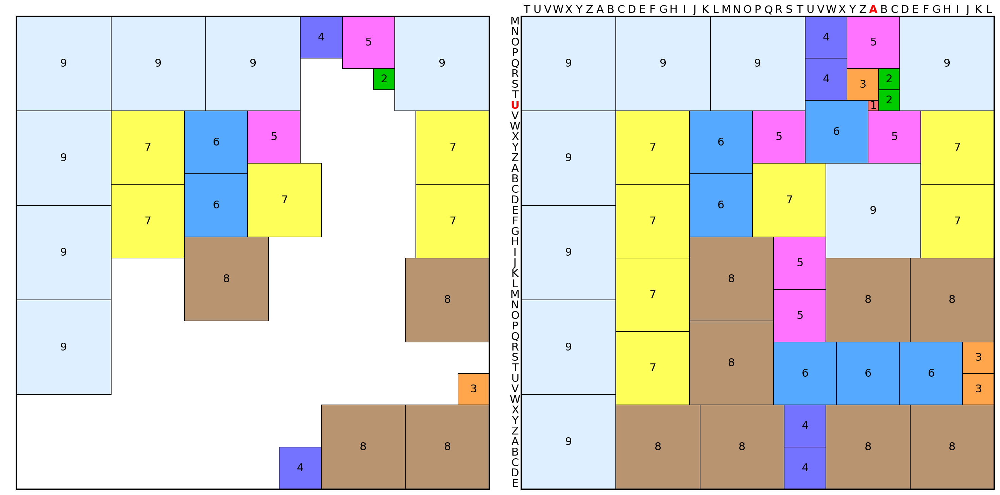
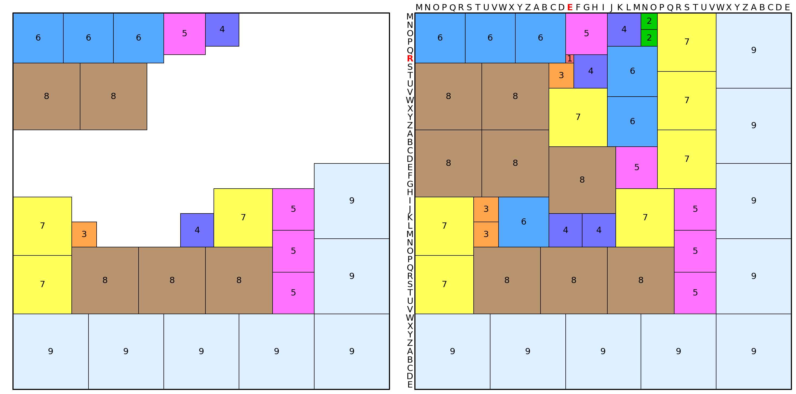

# Some Ones, Somewhere

## Description

The answer to this month’s puzzle – which can be seen [here](june-2025-puzzle.pdf) – is a sentence.

## Approach

The program uses a simple backtrack algorithm to find the solution.

An optimization was to check if a large tile cannot be placed too close to the grid border; otherwise, there are not enough smaller squares to fill the gap.
E.g: if we set a 9×9 tile with a right gap of $\delta = 2$ (assume no squares), it means we have a 2×9 rectangular gap that cannot be filled with the two 2-tiles and 1-tile.
On the other hand, if the gap is $\delta = 3$ we can use three 3-tiles to fill the 3×9 gap.
This can be formalized as follows: let $\delta$ be the gap (in any direction) and $s$ the side of the square, then this translates to $\delta \ge 1$ and $\delta^2 < s$.
This however fails for $s \ge 17$ (or $\delta > 3$), where we can fill a 4×17 rectangular gap with four 4-squares and two 2-squares.
So we can prune any configuration if
$$1 \le \delta \le 3 \qquad \delta^2 < s$$
where $s$ is the side of the placed square with any directional padding $\delta$.

Quite certainly more early pruning can be done to improve performance.

> **Note:** this problem in particular can be solved in faster runtime with solvers like Z3, but I purposefully tried a solution without any external solvers.

## Solution

By solving each 45×45 partridge tiling grid, we group the positions for the unique 1×1 squares in the tiling. These point to positions of letters in the tiling borders which can be completed by using the cycled alphabet, i.e. each row/column will have the letters if they match index:

0. `ABCDEFGHIJKLMNOPQRSTUVWXYZABCDEFGHIJKLMNOPQRS`
1. `TUVWXYZABCDEFGHIJKLMNOPQRSTUVWXYZABCDEFGHIJKL`
2. `MNOPQRSTUVWXYZABCDEFGHIJKLMNOPQRSTUVWXYZABCDE`

In row-major order of the tilings, the positions of 1-by-1 squares are:

-   (31, 16), (18, 20), (15, 32)
-   (27, 27), (8, 33), (11, 25)
-   (6, 16), (5, 18), (12, 21)

By selecting the correct string of characters for the partridge tiling, this translates to

-   (S, U), (M, O), (F, C)
-   (U, B), (E, S), (I, S)
-   (S, Q), (U, A), (R, E)

> **Note:** Before rows 0 and 2 we have the words **THE** and **A**

**The solution is:** `THE SUM OF CUBES IS A SQUARE`

## Completed partridge tilings (some-ones-somewhere output)

> **Note:** The tiling configuration is a collection of `(s, (r, c))`. Each entry represents a square of side `s` with top-left corner at `(r,c)` using a raster coordinate system (inverted Y-X plane).

#### Grid (0, 0)

Tiling configuration: `[(1, (18, 20)), (2, (0, 9)), (2, (2, 9)), (3, (4, 12)), (3, (4, 9)), (3, (26, 14)), (4, (0, 33)), (4, (4, 33)), (4, (0, 11)), (4, (9, 29)), (5, (24, 9)), (5, (19, 9)), (5, (8, 33)), (5, (9, 15)), (5, (14, 15)), (6, (13, 9)), (6, (7, 9)), (6, (26, 17)), (6, (26, 23)), (6, (32, 17)), (6, (32, 23)), (7, (38, 31)), (7, (38, 38)), (7, (15, 38)), (7, (8, 38)), (7, (19, 14)), (7, (38, 17)), (7, (38, 24)), (8, (37, 9)), (8, (29, 9)), (8, (30, 37)), (8, (30, 29)), (8, (22, 37)), (8, (0, 37)), (8, (18, 21)), (8, (22, 29)), (9, (9, 0)), (9, (18, 0)), (9, (27, 0)), (9, (36, 0)), (9, (13, 29)), (9, (0, 24)), (9, (0, 15)), (9, (0, 0)), (9, (9, 20))]`

#### Grid (0, 1)

Tiling configuration: `[(1, (12, 21)), (2, (8, 36)), (2, (8, 38)), (3, (25, 21)), (3, (4, 9)), (3, (25, 24)), (4, (0, 0)), (4, (0, 4)), (4, (0, 8)), (4, (8, 32)), (5, (24, 16)), (5, (0, 40)), (5, (5, 40)), (5, (7, 21)), (5, (19, 16)), (6, (0, 26)), (6, (6, 26)), (6, (7, 9)), (6, (7, 15)), (6, (13, 16)), (6, (19, 21)), (7, (29, 0)), (7, (29, 7)), (7, (29, 14)), (7, (0, 19)), (7, (0, 12)), (7, (12, 22)), (7, (12, 29)), (8, (28, 21)), (8, (28, 29)), (8, (28, 37)), (8, (0, 32)), (8, (13, 0)), (8, (13, 8)), (8, (21, 0)), (8, (21, 8)), (9, (36, 0)), (9, (36, 9)), (9, (36, 18)), (9, (36, 27)), (9, (36, 36)), (9, (19, 36)), (9, (19, 27)), (9, (10, 36)), (9, (4, 0))]`

#### Grid (0, 2)

Tiling configuration: `[(1, (31, 16)), (2, (5, 30)), (2, (7, 30)), (3, (29, 20)), (3, (24, 28)), (3, (29, 17)), (4, (5, 26)), (4, (41, 37)), (4, (41, 41)), (4, (5, 32)), (5, (0, 26)), (5, (34, 23)), (5, (29, 23)), (5, (0, 31)), (5, (24, 23)), (6, (39, 16)), (6, (39, 22)), (6, (21, 31)), (6, (15, 31)), (6, (9, 31)), (6, (23, 17)), (7, (16, 9)), (7, (38, 9)), (7, (9, 17)), (7, (32, 16)), (7, (9, 24)), (7, (16, 16)), (7, (31, 9)), (8, (0, 9)), (8, (8, 9)), (8, (33, 37)), (8, (25, 37)), (8, (17, 37)), (8, (9, 37)), (8, (16, 23)), (8, (23, 9)), (9, (0, 0)), (9, (9, 0)), (9, (18, 0)), (9, (27, 0)), (9, (36, 0)), (9, (0, 17)), (9, (0, 36)), (9, (36, 28)), (9, (27, 28))]`

#### Grid (1, 0)

Tiling configuration: `[(1, (27, 27)), (2, (33, 35)), (2, (33, 33)), (3, (9, 15)), (3, (17, 5)), (3, (16, 12)), (4, (16, 8)), (4, (35, 33)), (4, (15, 33)), (4, (15, 29)), (5, (17, 0)), (5, (22, 0)), (5, (28, 32)), (5, (7, 24)), (5, (28, 27)), (6, (0, 18)), (6, (6, 18)), (6, (39, 39)), (6, (39, 33)), (6, (33, 27)), (6, (39, 27)), (7, (9, 8)), (7, (20, 5)), (7, (0, 31)), (7, (0, 38)), (7, (0, 24)), (7, (12, 15)), (7, (12, 22)), (8, (9, 0)), (8, (7, 37)), (8, (15, 37)), (8, (23, 37)), (8, (31, 37)), (8, (7, 29)), (8, (19, 12)), (8, (19, 20)), (9, (0, 0)), (9, (0, 9)), (9, (36, 0)), (9, (36, 9)), (9, (36, 18)), (9, (27, 0)), (9, (19, 28)), (9, (27, 9)), (9, (27, 18))]`

#### Grid (1, 1)

Tiling configuration: `[(1, (11, 25)), (2, (0, 0)), (2, (0, 2)), (3, (12, 42)), (3, (9, 42)), (3, (12, 33)), (4, (2, 0)), (4, (25, 33)), (4, (7, 22)), (4, (21, 33)), (5, (6, 7)), (5, (6, 12)), (5, (7, 31)), (5, (6, 17)), (5, (7, 26)), (6, (15, 39)), (6, (0, 4)), (6, (0, 10)), (6, (0, 16)), (6, (9, 36)), (6, (15, 33)), (7, (13, 0)), (7, (6, 0)), (7, (29, 31)), (7, (29, 38)), (7, (0, 29)), (7, (0, 22)), (7, (29, 24)), (8, (28, 0)), (8, (28, 8)), (8, (28, 16)), (8, (20, 0)), (8, (20, 8)), (8, (21, 37)), (8, (12, 25)), (8, (20, 16)), (9, (36, 0)), (9, (36, 9)), (9, (11, 7)), (9, (36, 36)), (9, (0, 36)), (9, (11, 16)), (9, (20, 24)), (9, (36, 18)), (9, (36, 27))]`

#### Grid (1, 2)

Tiling configuration: `[(1, (15, 32)), (2, (20, 34)), (2, (20, 32)), (3, (26, 9)), (3, (13, 33)), (3, (26, 12)), (4, (0, 9)), (4, (0, 13)), (4, (16, 32)), (4, (36, 35)), (5, (40, 35)), (5, (40, 40)), (5, (15, 17)), (5, (15, 22)), (5, (15, 27)), (6, (7, 33)), (6, (7, 39)), (6, (22, 39)), (6, (28, 39)), (6, (34, 39)), (6, (20, 9)), (7, (0, 17)), (7, (0, 24)), (7, (0, 31)), (7, (0, 38)), (7, (22, 32)), (7, (29, 17)), (7, (29, 32)), (8, (7, 25)), (8, (37, 9)), (8, (29, 9)), (8, (4, 9)), (8, (7, 17)), (8, (12, 9)), (8, (20, 24)), (8, (28, 24)), (9, (0, 0)), (9, (9, 0)), (9, (18, 0)), (9, (27, 0)), (9, (36, 0)), (9, (13, 36)), (9, (36, 17)), (9, (20, 15)), (9, (36, 26))]`

#### Grid (2, 0)

Tiling configuration: `[(1, (6, 16)), (2, (38, 34)), (2, (36, 34)), (3, (12, 17)), (3, (12, 20)), (3, (18, 28)), (4, (36, 26)), (4, (16, 41)), (4, (16, 37)), (4, (36, 30)), (5, (40, 26)), (5, (40, 31)), (5, (6, 23)), (5, (11, 23)), (5, (16, 23)), (6, (0, 22)), (6, (0, 16)), (6, (6, 17)), (6, (18, 31)), (6, (24, 31)), (6, (30, 31)), (7, (15, 9)), (7, (22, 9)), (7, (0, 9)), (7, (15, 16)), (7, (29, 17)), (7, (22, 16)), (7, (29, 24)), (8, (7, 9)), (8, (37, 9)), (8, (29, 9)), (8, (28, 37)), (8, (20, 37)), (8, (0, 37)), (8, (8, 37)), (8, (21, 23)), (9, (0, 0)), (9, (9, 0)), (9, (18, 0)), (9, (27, 0)), (9, (36, 0)), (9, (36, 17)), (9, (36, 36)), (9, (0, 28)), (9, (9, 28))]`

#### Grid (2, 1)

Tiling configuration: `[(1, (8, 33)), (2, (5, 34)), (2, (7, 34)), (3, (34, 42)), (3, (5, 31)), (3, (31, 42)), (4, (0, 27)), (4, (41, 25)), (4, (4, 27)), (4, (37, 25)), (5, (0, 31)), (5, (9, 22)), (5, (9, 33)), (5, (21, 24)), (5, (26, 24)), (6, (9, 16)), (6, (15, 16)), (6, (8, 27)), (6, (31, 24)), (6, (31, 30)), (6, (31, 36)), (7, (9, 38)), (7, (16, 38)), (7, (9, 9)), (7, (16, 9)), (7, (14, 22)), (7, (23, 9)), (7, (30, 9)), (8, (23, 37)), (8, (21, 16)), (8, (37, 37)), (8, (37, 29)), (8, (23, 29)), (8, (29, 16)), (8, (37, 9)), (8, (37, 17)), (9, (0, 0)), (9, (0, 9)), (9, (0, 18)), (9, (9, 0)), (9, (18, 0)), (9, (0, 36)), (9, (27, 0)), (9, (14, 29)), (9, (36, 0))]`

#### Grid (2, 2)

Tiling configuration: `[(1, (5, 18)), (2, (0, 27)), (2, (2, 27)), (3, (25, 7)), (3, (6, 16)), (3, (22, 7)), (4, (24, 20)), (4, (0, 23)), (4, (5, 19)), (4, (24, 16)), (5, (31, 31)), (5, (26, 31)), (5, (21, 31)), (5, (0, 18)), (5, (16, 24)), (6, (0, 0)), (6, (0, 6)), (6, (0, 12)), (6, (4, 23)), (6, (10, 23)), (6, (22, 10)), (7, (22, 0)), (7, (29, 0)), (7, (21, 24)), (7, (0, 29)), (7, (7, 29)), (7, (9, 16)), (7, (14, 29)), (8, (28, 7)), (8, (28, 15)), (8, (28, 23)), (8, (6, 0)), (8, (6, 8)), (8, (14, 0)), (8, (14, 8)), (8, (16, 16)), (9, (36, 0)), (9, (36, 9)), (9, (36, 18)), (9, (36, 27)), (9, (36, 36)), (9, (27, 36)), (9, (18, 36)), (9, (0, 36)), (9, (9, 36))]`

## Analytics

-   Average runtime: ~17m (Apple Silicon M1 Pro)
