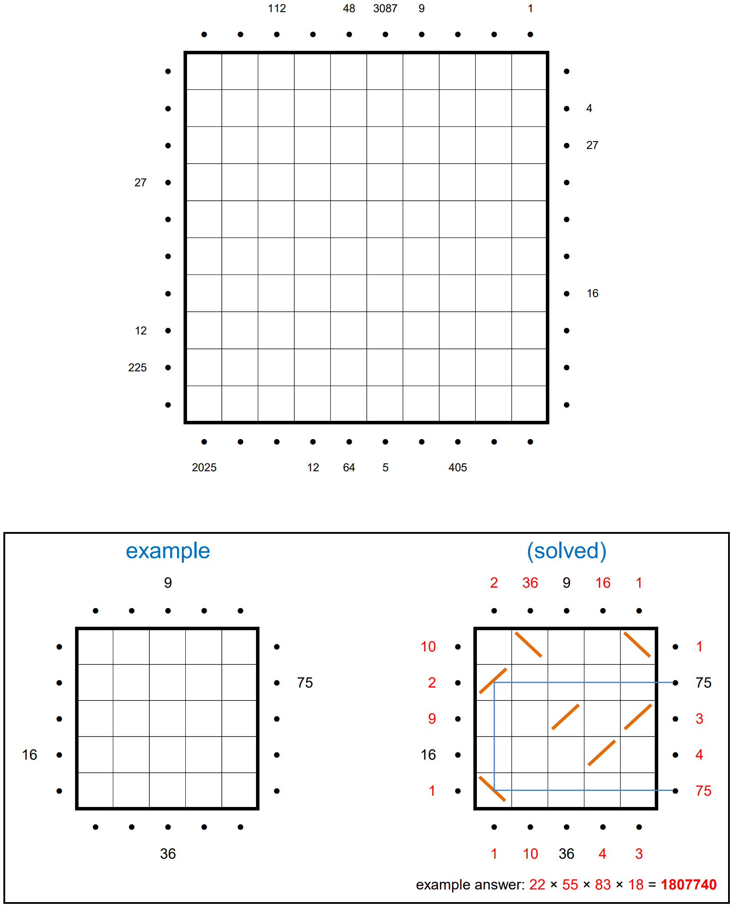
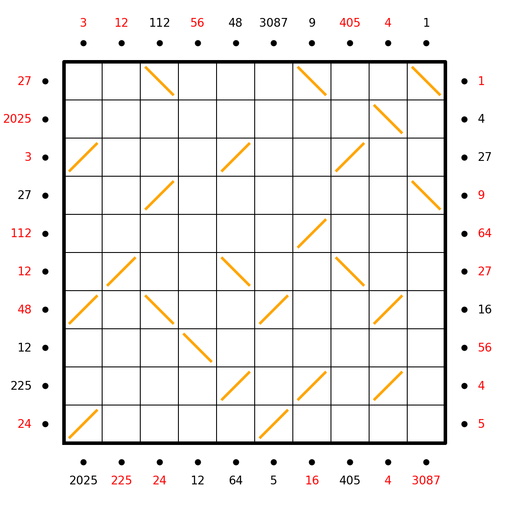

# Hall of Mirrors 3

## Description



The perimeter of a 10-by-10 square field is surrounded by lasers pointing into the field. (Each laser begins half a unit from the edge of the field, as indicated by the •’s.)

Some of the lasers have numbers beside them. Place diagonal mirrors in some of the cells so that the product of the segment lengths of a laser’s path matches the clue numbers. (For instance, the segments for the “75” path in the example puzzle have lengths 5, 3, 5.) Mirrors may not be placed in orthogonally adjacent cells.

Once finished, determine the missing clue numbers for the perimeter, and calculate the sum of these clues for each side of the square. The answer to this puzzle is the product of these four sums.

## Approach

The program uses a backtrack algorithm to find the solution.

-   Precomputation of all the integer factorizations (setting max factor to be grid side)
-   Sort border inputs by the number of factorizations
-   Iterate through the possible factorizations of all the input numbers and try to place two types of mirrors, checking if path traced is valid

## Solution

-   Left sum: **2251**
-   Top sum: **480**
-   Right sum: **166**
-   Bottom sum: **3356**

The solution is product: 2251 \* 480 \* 166 \* 3356 = **635664640**

## Completed grid (mirror-3 output)

```
        3    12    112   56    48   3087    9    405    4     1
     +-----+-----+-----+-----+-----+-----+-----+-----+-----+-----+
     |     |     | \   |     |     |     | \   |     |     | \   |
  27 |     |     |   \ |     |     |     |   \ |     |     |   \ | 1
     +-----+-----+-----+-----+-----+-----+-----+-----+-----+-----+
     |     |     |     |     |     |     |     |     | \   |     |
2025 |     |     |     |     |     |     |     |     |   \ |     | 4
     +-----+-----+-----+-----+-----+-----+-----+-----+-----+-----+
     |   / |     |     |     |   / |     |     |   / |     |     |
   3 | /   |     |     |     | /   |     |     | /   |     |     | 27
     +-----+-----+-----+-----+-----+-----+-----+-----+-----+-----+
     |     |     |   / |     |     |     |     |     |     | \   |
  27 |     |     | /   |     |     |     |     |     |     |   \ | 9
     +-----+-----+-----+-----+-----+-----+-----+-----+-----+-----+
     |     |     |     |     |     |     |   / |     |     |     |
 112 |     |     |     |     |     |     | /   |     |     |     | 64
     +-----+-----+-----+-----+-----+-----+-----+-----+-----+-----+
     |     |   / |     |     | \   |     |     | \   |     |     |
  12 |     | /   |     |     |   \ |     |     |   \ |     |     | 27
     +-----+-----+-----+-----+-----+-----+-----+-----+-----+-----+
     |   / |     | \   |     |     |   / |     |     |   / |     |
  48 | /   |     |   \ |     |     | /   |     |     | /   |     | 16
     +-----+-----+-----+-----+-----+-----+-----+-----+-----+-----+
     |     |     |     | \   |     |     |     |     |     |     |
  12 |     |     |     |   \ |     |     |     |     |     |     | 56
     +-----+-----+-----+-----+-----+-----+-----+-----+-----+-----+
     |     |     |     |     |   / |     |   / |     |   / |     |
 225 |     |     |     |     | /   |     | /   |     | /   |     | 4
     +-----+-----+-----+-----+-----+-----+-----+-----+-----+-----+
     |   / |     |     |     |     |   / |     |     |     |     |
  24 | /   |     |     |     |     | /   |     |     |     |     | 5
     +-----+-----+-----+-----+-----+-----+-----+-----+-----+-----+
      2025   225   24    12    64     5    16    405    4   3087
```

## Completed grid



## Analytics

- Average runtime: ~1 millisecond (Apple Silicon M1 Pro)
