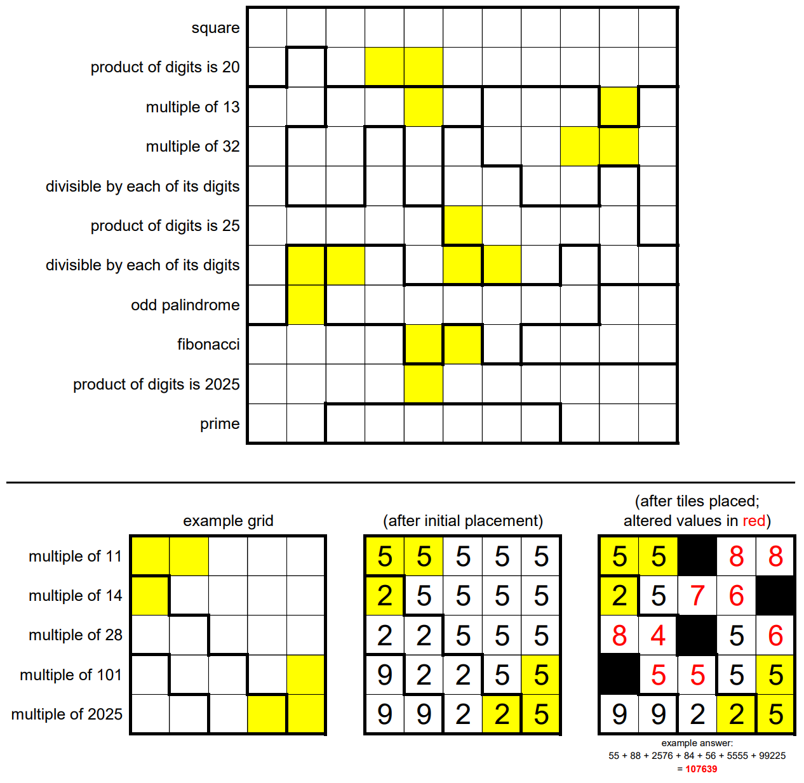

# Number Cross 5

The 11-by-11 grid above is divided into several regions. Place positive digits (1-9) into the cells. Every cell within a region must contain the same digit, and orthogonally adjacent cells in different regions must have different digits.

After doing this, place some tiles into the grid. Tiles are represented by blacking out a cell, and no two tiles are allowed to share a common edge. When a tile is placed on a cell, it displaces the value (digit) in that cell. That means the orthogonally adjacent cells, collectively, must be incremented by that displaced value. (For instance, in the example the rightmost tile displaces a 5. That displaced 5 results in increments of 1 for the cells below and to the left of the tile, and an increment of 3 for the cell above it.)

Digits may not be incremented any higher than 9. Incrementing digits may cause neighboring cells from different regions to contain the same value – this is fine. Some cells have been highlighted: these cells may not contain tiles and may not be altered by any of the increments.

And finally! Each row has been supplied with a clue. Every number formed by concatenating consecutive groups of un-tiled cells within a row must satisfy the clue given for the row. (As in the example.) Numbers must be at least two digits long and may not repeat in the grid.

The answer to this month’s puzzle is the sum of all the numbers formed in the completed grid. (As in the example.)
